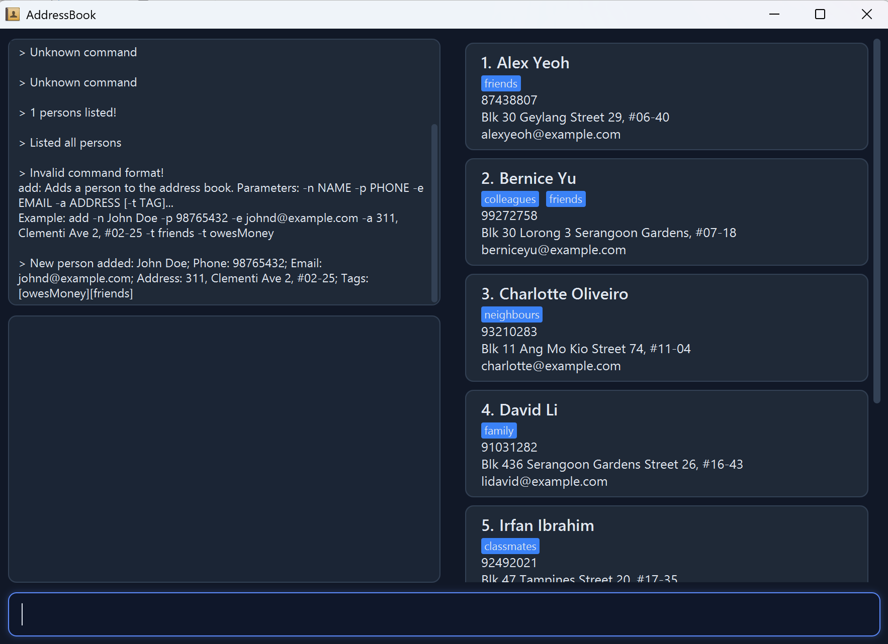

* SpyGlass is a desktop application for managing sensitive contact details, optimised for users who require high-speed input and discretion.
* It is a specialised evolution of the AddressBook Level 3 (AB3) project, tailored for covert operations and high-pressure environments.

* Key Features 
  * Stealth Dummy (Lock/Unlock): Features a panic button (lock command) that instantly swaps the sensitive UI with a harmless, functional dummy interface to deceive casual observers. 
  * Hidden Authentication: Transitioning back to real data is handled via a hidden password command, which masquerades as an "unknown command" to maintain the illusion of a mundane application. 
  * Optimized for CLI: Designed for users who can type fast. 
  * Robust Data Management: Supports adding, deleting, listing and advanced searching of contacts with strict validation to ensure data integrity. 
  * Paginated Display: An organised, paginated list view to manage large volumes of intelligence data without clutter.

* Project Characteristics 
  * Written in OOP fashion: Provides a clean, extensible codebase for Software Engineering students. 
  * Size: Approximately 6 KLoC, offering a realistic project scale without being overwhelming. 
  * Documentation: Comes with comprehensive User and Developer guides adapted for the SpyGlass ecosystem.

* For the detailed documentation of this project, see the **[SpyGlass User Guide](https://ay2526s2-cs2103t-t15-2.github.io/tp/)**.

* This project is a **part of the se-education.org** initiative. If you would like to contribute code to this project, see [se-education.org](https://se-education.org/#contributing-to-se-edu) for more info.
